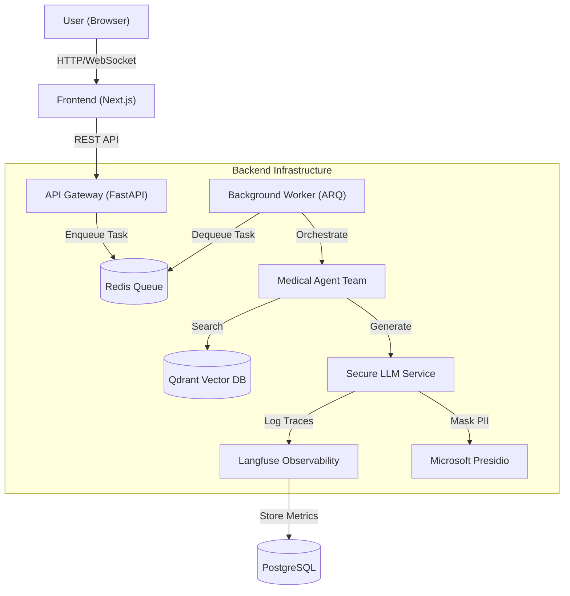

# Synapse Enterprise: Medical Agentic RAG Platform

[](https://python.org)
[](https://fastapi.tiangolo.com)
[](https://nextjs.org)
[](https://www.docker.com)
[](https://opensource.org/licenses/MIT)

**Synapse Enterprise** is a scalable, secure, and asynchronous **Retrieval-Augmented Generation (RAG)** platform designed for analyzing complex medical documentation. It leverages a microservices architecture, multi-agent orchestration (**Microsoft AutoGen**), and vector search to provide precise, hallucination-resistant answers.

> **Enterprise Grade:** Built with privacy (PII masking), observability (Langfuse), and scalability (Redis/Celery-style workers) from day one.

---

## System Architecture

Synapse allows for asynchronous processing of heavy RAG tasks without blocking the main API, ensuring high throughput and resilience.


# Key Components
Frontend: Next.js (React) for a responsive chat interface and document management.

Backend API: Asynchronous FastAPI service handling authentication, file uploads, and task dispatching.

Async Worker: Decoupled worker service (ARQ/Redis) for executing long-running agentic workflows.

Vector Database: Qdrant for high-performance dense and sparse vector retrieval.

Observability: Self-hosted Langfuse for tracking LLM costs, latency, and quality.

# Key Features
## 1. Multi-Agent Collaboration (AutoGen)
Instead of a single LLM call, Synapse deploys a team of agents:

Researcher: Performs semantic search over the vector database.

Critic: Validates the Researcher's answers against retrieved context to prevent hallucinations.

Admin: Orchestrates the conversation flow.

## 2. Enterprise Security & Privacy
PII Masking: Automatic redaction of sensitive data (PESEL, Names, Phone Numbers) using Microsoft Presidio and spaCy before data leaves the infrastructure.

Secure LLM Gateway: Centralized service wrapper for all LLM interactions.

## 3. High Performance
Non-blocking I/O: Fully asynchronous Python architecture.

Load Tested: Validated with Locust to handle 50+ concurrent users with sub-millisecond API latency (in cached/mock mode).

Hybrid Search: Combines dense embeddings (Semantic) with sparse vectors (Keywords) for maximum retrieval accuracy.

# Installation & Setup
Prerequisites
Docker & Docker Compose

OpenAI API Key

(Optional) Langfuse Public/Secret Keys for monitoring

## 1. Clone Repository
```
git clone [https://github.com/malipie/synapse.git](https://github.com/malipie/synapse.git)
cd synapse-enterprise
```
## 2. Environment Configuration
Create a .env file in the root directory:
```
# AI Configuration
OPENAI_API_KEY=sk-your-openai-key-here
OPENAI_MODEL_NAME=gpt-3.5-turbo

# Infrastructure
REDIS_HOST=synapse-redis
QDRANT_HOST=synapse-qdrant

# Observability (Langfuse)
LANGFUSE_HOST=[https://cloud.langfuse.com](https://cloud.langfuse.com)
LANGFUSE_PUBLIC_KEY=pk-lf-...
LANGFUSE_SECRET_KEY=sk-lf-...

# Testing
MOCK_LLM=false
```
### 3. Launch with Docker
Build and start the entire stack:
```
docker-compose up -d --build
```

## 4. Access Points
Frontend Application: http://localhost:3000

Backend API Docs: http://localhost:8000/docs

Qdrant Dashboard: http://localhost:6333/dashboard

Langfuse Monitoring: http://localhost:3001

# Testing & Quality Assurance
Synapse includes a robust testing suite to ensure enterprise reliability.

## Unit Tests (Backend)
Run pytest inside the container to test logic isolation and PII masking.

```
docker-compose exec synapse-backend pytest
```

## Load Testing (Locust)
A pre-configured locustfile.py is included to simulate heavy traffic.

Ensure containers are running.

Run the Locust container (or local instance):

```
docker run -p 8089:8089 -v $PWD/locustfile.py:/mnt/locust/locustfile.py locustio/locust -f /mnt/locust/locustfile.py
```

## Open http://localhost:8089 and simulate 50+ users.

# Project Structure
.
├── backend/
│   ├── app/
│   │   ├── agents/         # AutoGen agents (Researcher, Critic)
│   │   ├── api/            # FastAPI routers (Chat, Documents)
│   │   ├── core/           # Config & Secure LLM Service (PII)
│   │   └── rag/            # Vector Store logic (Qdrant)
│   ├── tests/              # Pytest unit tests
│   └── worker.py           # ARQ Worker entrypoint
├── frontend/               # Next.js Application
├── docker-compose.yml      # Infrastructure definition
└── locustfile.py           # Load testing scenarios

# Future Roadmap
Local LLM Support: Integration with Ollama/vLLM for fully air-gapped deployments.

Automated Evaluation: Implementing DeepEval/Ragas for CI/CD quality gates on RAG answers.

UI Builder Agent: Dynamic UI generation based on user intent.


Author: Marcin Lipiec License: MIT